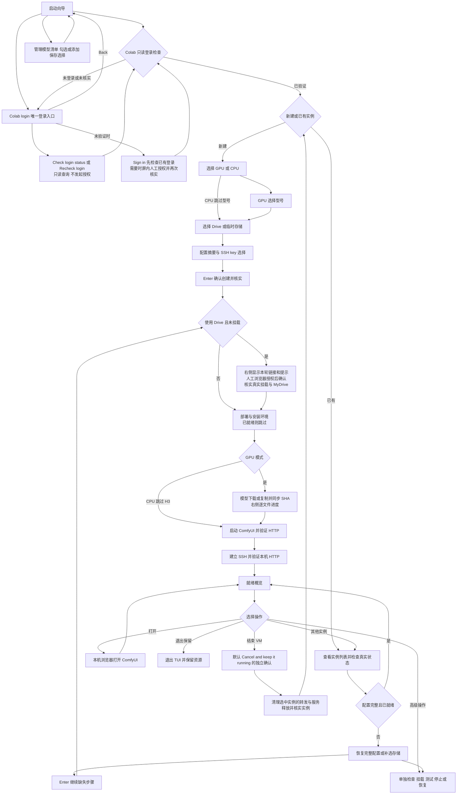

# 启动向导与恢复流程

在仓库根目录运行 `python3 scripts/dashboard.py`。上下键选择，Enter 确认；可回退页面统一选择 **Back**，Esc 也可返回或取消输入。真正创建前先查看摘要。主流程默认使用 SSH 本机访问，无需进入 `colab console`。

首页自动执行只读登录检查，并只保留 **Colab login** 一个登录入口。账号页已验证时显示 **Recheck login** 与 **Back**；未验证时显示 **Check login status**、**Sign in** 与 **Back**。Check / Recheck 只查询会话，不发起交互授权或分配实例；Sign in 先检查已有登录，仅在需要时进入浏览器授权。网络错误显示未核实，不表示已退出登录。创建前再次核实登录。

首次 CLI 登录也可能需要浏览器和授权 code。官方 Drive 确认读取 `/dev/tty`，因此使用真正拥有控制终端的子 PTY。主界面仍负责导航和高对比输入，链接、授权说明、错误和阶段显示在右侧。用户提交 code 时遮罩，完成后清空授权状态；不保存授权截图或原始终端日志。官方 CLI 自己的历史记录行为不由本项目控制。

账户检查、实例列表与 Inspect 等待期间显示不可执行的 **Loading...**，**Back** 仍可用；不会先出现一个可执行的 Exit 来代替真实菜单。Back 返回并保留已有 VM、服务、SSH 与远端任务；它不等于结束 VM。授权的浏览器按钮或人工确认只在提供方要求时出现。

Drive 模式将模型持久缓存放在所选 Drive 专用目录；新 VM 的复制流同步 SHA，生成验证后的 VM 普通文件；ComfyUI 始终从 VM 加载，输出回 Drive。临时模式直接下载到 VM 模型目录并同步 SHA，没有第二份完整模型缓存；输出随 VM 释放而失去保留保证。下载默认同时处理两个文件，可设为 1–4；Drive → VM 复制仍顺序进行。CPU 只做编辑器与无模型 PNG 测试。

进度展示区分下载/复制/本地 SHA、最终校验通过与同 VM 验证记录复用；后者明确不是重新计算 SHA。字节 100% 还不等于最终验证完成。安装只显示真实阶段，不伪造安装百分比。

已有实例只恢复完整、有效的持久化目录和访问配置；缺失配置先补选。正在运行的任务等待完成，未知结果先检查，不能自动重试创建或重新安装。存储或访问方式与运行服务不一致时，先到高级操作明确停止；不会暗中替用户切换。

SSH 会发现该实例唯一有效的本机 owned 转发，恢复端口和专用 key 路径并再验证 HTTP。发现只读、校验进程身份和监听归属，不读取私钥；多个连接或活跃旧记录缺少配置时拒绝猜测，可用已知端口手动停止旧转发后再继续。高级 H3 API 测试的运行/完成状态及已验证输出显示在右侧，服务 Ready 不等于渲染任务已完成。

G4 是当前 H3 配置的实测型号；其余 GPU 选项只表示已安装 Colab CLI 接受该名称，兼容性、显存需求和账号供应未验证。菜单标签是项目测试记录，不因用户成功创建或启动实例而自动变成已测。实际硬件以实例状态为准，权重文件大小不等于推理显存需求。此向导不自动换模型精度。

完整双栏布局需至少 110×32；50×24 起提供紧凑布局，更小窗口显示调整大小与错误提示。紧凑布局的 **STARTUP FLOW** 用箭头连接步骤，按宽度换行，与操作区之间留出空行；优先显示登录或授权、错误、就绪网址和逐模型进度，PgUp / PgDn 保留完整详情。两种布局共用同一套状态：`+` 已验证为黄绿色，`>` 当前步骤为橙色，`-` 跳过为灰色；空闲页面按当前页面显示步骤，不沿用已结束操作的阶段。登录、状态提示、选项说明与模型来源各生成一次，紧凑详情不再重复追加相同信息。模型添加确认页在首屏显示来源网址、目标目录和自动下载选择。

Esc 的等待时间为 50 ms；完整屏幕通过一次 noutrefresh / doupdate 更新。Python 标准库实现不要求额外 UI 框架。`NO_COLOR` 或 `--no-color` 使用无彩色风格，`TERM=dumb` 使用数字选择并回车。2026-10-08 的导航和布局验证属于本机终端与受控状态测试，没有分配云端实例、执行 Drive 授权或操作用户已有任务；它不代替真实云端启动验收。

## 恢复边界

Inspect 读取真实状态，不保证修复未知结果。默认向导在以下两种情况不会自行重试：

- 安装进程被强制终止、来不及写入最终结果时，状态可能残留 `installing`。继续会等待已有安装，可能再次超时；TUI 无法据此确认进程已消失。无法用 CLI 核实实际进程和锁状态时，可选择 **End this VM**，确认结束当前实例后重建。
- 模型准备控制器中断、未留下可信结果时，`model_prepare` 会显示 `interrupted`。再次 Inspect 不会清除该状态，默认向导也不会自动重启准备。需先用 CLI 核对任务进程与结果，再显式执行 `scripts/colabctl.py` 的 `prepare` 操作；Drive 模式保留原 `--cache-root`，临时模式使用 `--ephemeral`。无法确认时，可选择 **End this VM** 后重建。

结束 VM 保留 Drive 缓存和输出；临时 VM 磁盘上的模型与输出不会保留。

当前各轮的真实执行结果与未验证边界见 [实测记录](test-report.md)。历史旧操作码界面可以用 `--classic` 打开，其交互与新向导不同。
